## Steps to Create a SSL Certificate
#### Generate a CSR (Certificate Signing Request)
- open mmc in in windows and create a custom request:-  
File > Add or Remove Snap-ins > Certificates > add > ok > Certificates-Current User > Personal > Certificates > All Task > Advance operations > Create custom request  
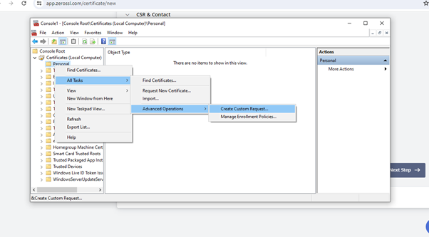  

#### Certificate Information

##### Details > Properties >  

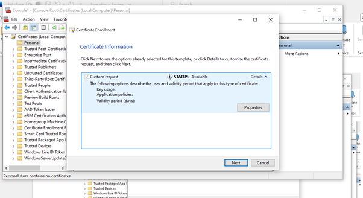 
In `General` tab fill the friendly name:  
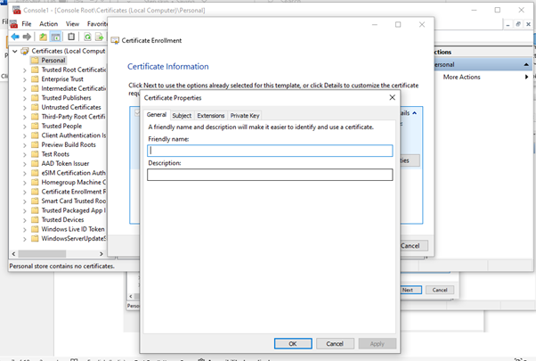  
In `Subject` tab add domain CNAME, ORG etc.  
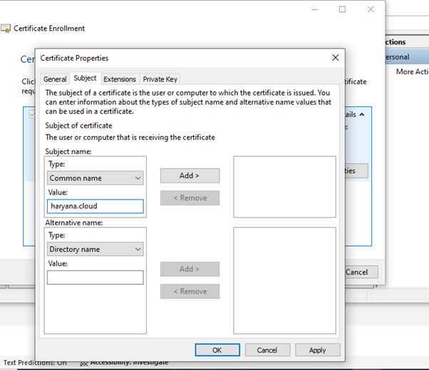  
In `Private Key` tab select key size: 2048 for key option and check mark `Make private key exportable` then `Apply`  
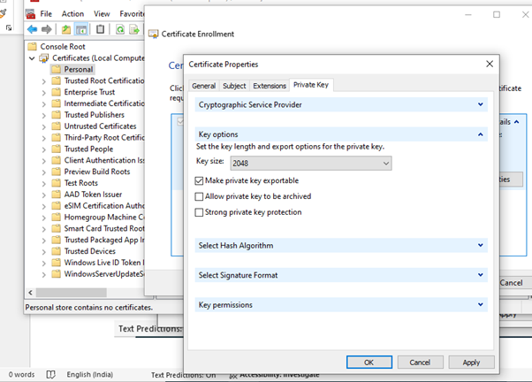  

##### Now Save your CSR
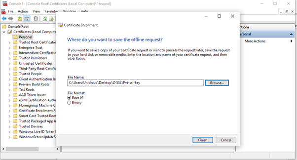  
Keep the private key (.key) safe — you’ll need it for installation.

##### Open CSR file in text editor and copy  
  

##### Submit CSR to Namecheap  
Go to your SSL certificate in Namecheap  
Paste your CSR.  
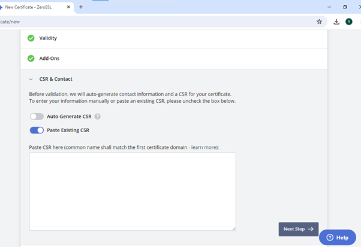   

##### Domain Control Validation (DCV)  
You must validate ownership of your domain.  
DNS validation (add a CNAME record)   
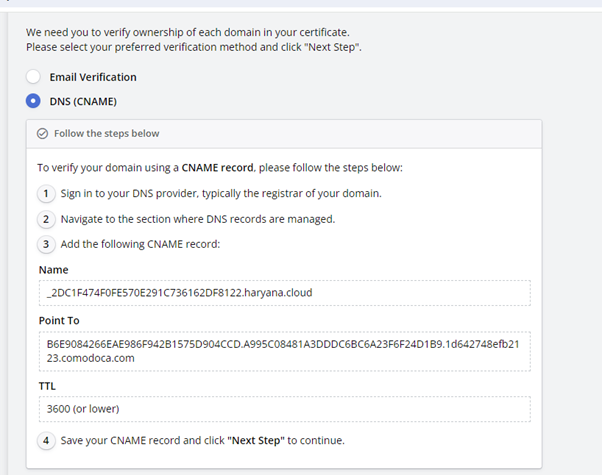 

##### Receive New SSL Files
Once validation is done, Namecheap will issue the renewed SSL.  
You’ll get a .crt file (certificate) + CA bundle (intermediate certs).  
  
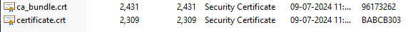 
Open the folder and install certificate.crt file.  

##### Go to MMC and check the certificate install or not, if certificate installed then export the pfx file.
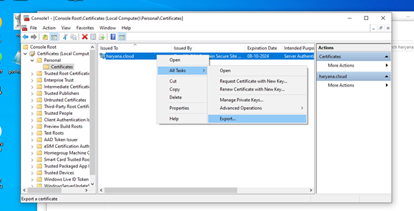 
Now you have a Personal Information Exchange (.pfx) file.
##### Extract the Certificate and Key from the .pfx File.
```
apt install openssl  (If you don’t have)
openssl pkcs12 -in yourfile.pfx -nocerts -out key.pem -nodes
openssl pkcs12 -in yourfile.pfx -clcerts -nokeys -out cert.pem
```
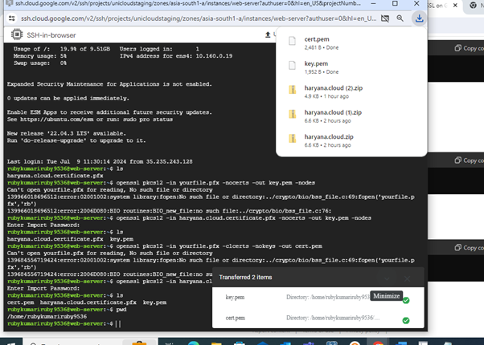  
- Now you have cert.pem and key.pem file.
- Upload it in GCP.
##### Verify the Chain
- Open cert.pen file and ca_bundle.crt file in notepad. Merge it and upload.
